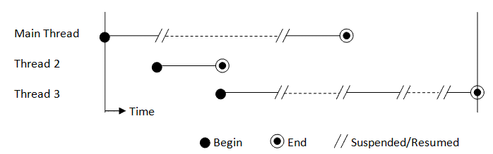

## 어플리케이션 (Application)
모든 Vapor 프로젝트는 `Application`을 하나 갖습니다. Application을 사용해서 서버를 구동하고 부팅 시에 필요한 서비스들을 생성할 수 있습니다.  

Application에 액세스하기에 최적의 장소는 여러분 프로젝트의 [boot.swift](/doc/GettingStarted/FolderStructure#boot.swift) 파일입니다.

```swift
import Vapor

public func boot(_ app: Application) throws {
    // 여기에 여러분의 코드를 입력하세요
}
```
다른 웹 프레임워크와 달리, Vapor는 application에 정적으로 액세스하는 걸 허용하지 않습니다. 다른 class나 struct에서 application에 액세스해야 한다면 메소드(method)나 생성자(initializer)를 통해야 합니다.  
  
ℹ️변수에 대한 정적 액세스를 통해 스레드세이프 락[^1](thread-safe lock)이나 세마포어[^2](semaphore)를 사용할 필요가 없어지기 때문에 Vapor의 성능을 향상시킵니다.

---
## 서비스
Application의 주요 기능은 서버를 부팅하는 것입니다.
```swift
try app.run()
```
하지만, 동시에 Application은 컨테이너이기도 합니다. 어플리케이션을 부팅하기 위해 필요한 서비스를 생성하기 위해 사용할 수 있습니다.  
  
⚠️Application이나 그로부터 생성된 서비스를 route closure 안에서 사용하지 마세요. 대신에 `Request`를 사용해서 서비스를 생성하세요.  
**boot.swift**
```swift
import Vapor

/// Called after your application has initialized.
public func boot(_ app: Application) throws {
	// Your code here
	let client = try app.make(Client.self)
	let res = try client.get("http://vapor.codes").wait()
	print(res) // Response
}
```

📖여기서는 route closure 안에 있지 않기 때문에 `.map`이나 `.flatMap` 대신에 `.wait()`을 사용해도 괜찮습니다.  
  
서비스에 대한 자세한 정보는 [Getting Started → Services](/doc/GettingStarted/Services)에서 확인하세요.

---

### 🐤초심자
📖변수에 대한 정적 액세스를 방지한다는게 정확히 무슨 말이죠?  
> Application 클래스의 인스턴스에 대한 직접적인 접근을 하지 못하도록 했다는 말입니다. boot.swift의 boot 메소드에서 Application을 인자로 받는 것을 볼 수 있는데요, 이렇게 다른 곳으로부터 인자 형식으로 Application을 건네 받아 그에 접근하는 방식을 구현한 것입니다.
	
📖스레드가 뭔가요?  

{: width="60%" height="60%"}
  
> 스레드란 어떠한 프로그램, 정확히는 프로세스 내에서 실행되는 흐름의 단위입니다. 일반적으로 하나의 프로그램에는 하나의 스레드가 존재하는데, 요즘은 둘 이상의 스레드를 사용하는 멀티스레딩이 점점 보편화되고 있는 추세입니다.  

> Swift 또한 멀티스레딩을 지원하므로 스레드 개념에 대해 알아두셔야 합니다. 스레드가 여러 개일 때의 문제점은, 한 스레드에서 작업이 진행되는 도중 어떠한 변수를 변경했을 때 다른 스레드에서 이러한 변수에 접근할 때 변경사항이 반영되지 않는 등의 오류가 발생할 수 있다는 것입니다. 이런 경우 스레드세이프(thread-safe)한 메소드를 사용하거나, 불변 객체(i.e. swift의 ```let```)를 사용하거나, 일련의 동기화 작업을 통해 문제를 해결할 수 있습니다.
  
> Vapor의 Application에 대해서는 그런 고민을 할 필요가 없습니다.

---
[^1]: 스레드세이프 락(thread-safe lock): 하나의 공유 자원에 여러 스레드가 접근하는 것을 제한하는 방법입니다.
[^2]: 세마포어: 하나의 공유 자원에 여러 프로세스가 접근하는 것을 제한하는 방법입니다.