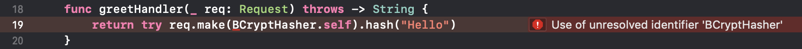

## 컨트롤러 (Controllers)

컨트롤러는 코드를 정리하기 좋은 장소입니다. 요청을 받아 응답을 리턴하는 여러 메소드들의 집합입니다.  
  
컨트롤러에 대한 코드를 넣기 좋은 장소는 [Controllers](/doc/GettingStarted/FolderStructure#controllers) 폴더입니다.

---
## 메소드 (Methods)

예시 컨트롤러:
```swift
import Vapor

final class HelloController {
    func greet(_ req: Request) throws -> String {
        return "Hello!"
    }
}
```
컨트롤러 메소드는 항상 ```Request```를 받아서 ```ResponseEncodable```한 무언가를 반환해야 합니다.  
  
📖추후에 ```ResponseEncodable```이 되는 ```Future```또한  ```ResponseEncodable```입니다.  
  
이 컨트롤러를 사용하려면, 컨트롤러를 초기화한 뒤 라우터에 메소드를 넘기면 됩니다.  
**routers.swift**
```swift
let helloController = HelloController()
router.get("greet", use: hellocontroller.greet)
```

---
## 서비스 사용하기
컨트롤러 내부에서 여러분의 [서비스](/doc/GettingStarted/Services)에 접근하고 싶을 수 있습니다. route closure 내부에서 서비스를 생성하려면 ```Request```를 컨테이너로 사용하세요. 서비스에 대한 캐싱은 Vapor가 관리합니다.  
  
이 예시는 BCryptHasher라는 서비스를 사용하는 것을 보여줍니다. 이 서비스는 웹에서 주로 비밀번호 등 민감한 정보를 해싱하여 안전하게 개인정보를 보관하는 데에 사용합니다.
```swift
final class HelloController {
    func greet(_ req: Request) throws -> String {
        return try req.make(BCryptHasher.self).hash("hello")
    }
}
```

⚠️공식 문서의 위 예시는 더이상 사용되지 않는 ```BCryptHasher```를 사용했기 때문에 ```Use of unresorved identifier``` 오류가 발생합니다. 대체 예시는 밑의 코드 블럭을 참조하세요.
  
  
  
**대체 예시**
```swift
import Vapor // Vapor 임포트가 선언되어 있지 않다면 반드시 하셔야 합니다.
import Crypt // 반드시 Crypt를 따로 임포트 하셔야 BCryptDigest를 사용할 수 있습니다.

final class HelloController {
	func greet(_ req: Request) throws -> String {
		// BCryptHasher는 더이상 사용되지 않아요. BCryptDigest를 사용하셔야 합니다.
		return try req.make(BCryptDigest.self).hash("hello")
	}
}
```

이렇게 한 뒤 루트를 설정하고, 서버를 구동한 뒤 해당 루트의 URL을 요청하면 ```BCryptDigest.hash(_:)```에 의해 해싱된 hello를 볼 수 있습니다.