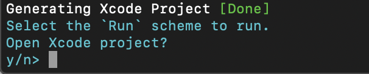
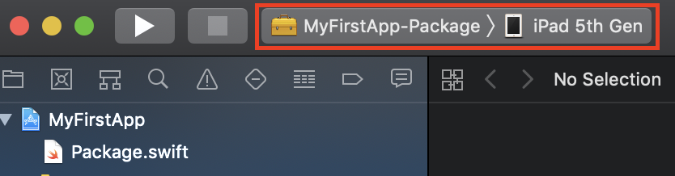
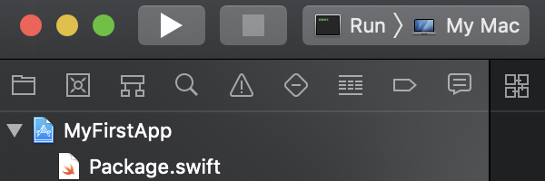

## Hello, world!
  
Vapor를 설치하셨으면 첫 번째 Vapor 앱을 만들어 봐요! 새로운 프로젝트를 만들고, 빌드하고, 구동하는 방법을 차근차근 배울거에요.

---
## 새로운 프로젝트
컴퓨터에 새로운 Vapor 프로젝트를 만들기 위해서는 터미널에서 아래 커맨드를 입력해야 해요.
```
# vapor new는 새로운 프로젝트를 생성하는 Vapor Toolbox 커맨드입니다.
# [name]에는 본인이 만들고 싶은 프로젝트의 이름을 입력해 주세요.
vapor new [name]
```
⚠️프로젝트 이름은 [Pascalcase][Pascalcase][^pascalcase]로 작성하세요.
```
# 예시: 프로젝트 이름을 'MyFirstApp'로 만들고 싶다면
vapor new MyFirstApp
```

프로젝트 생성에 성공하면 이런 화면이 터미널에 출력됩니다.  

{: width="60%" height="60%"}
  
프로젝트 이름은 MyFirstApp로 가정하고 진행할게요.
```
# MyFirstApp 폴더로 진입하는 커맨드입니다.
cd MyFirstApp
```

---
## Xcode 프로젝트 생성하기
Vapor Toolbox의 ```xcode``` 명령어를 사용해서 Xcode 프로젝트를 생성할 수 있어요. 이렇게 하면 iOS 앱처럼 Vapor 앱을 Xcode에서 앱을 빌드하고 구동할 수 있습니다.
```
# 반드시 MyFirstApp 폴더에 진입한 뒤 아래 커맨드를 입력해주세요.
vapor xcode
```
  
{: width="60%" height="60%"}
  
프로젝트 생성에 성공하면 위처럼 Xcode를 자동으로 실행할거냐고 물을텐데요, ```y```를 입력해서 Xcode를 실행해 주세요.

---

## 빌드 & 구동
  
{: width="60%" height="60%"}

⚠️Xcode를 열었으면 좌측 상단 sceheme menu에서 run scheme를 선택하고, Deployment target 메뉴에서는 My Mac을 선택하세요.

{: width="60%" height="60%"}
  
그런 다음 플레이 버튼을 누르거나 ```Command + R```을 눌러서 빌드 & 구동할 수 있어요

```
# 구동 후 터미널에 이런 메시지가 뜨면 성공입니다.
Server starting on http://localhost:8080
```

---
## Localhost 접속
웹 브라우저를 켜서 [localhost:8080/hello](localhost:8080/hello)에 접속하세요.  
페이지에 ```Hello, world!```가 출력된다면 성공입니다! 🎉

---

### 🐤초심자
📖**Localhost**가 뭔가요?  
> localhost는 루프백 호스트명이라고 해서,  일반적인 경우 IPv4에서 127.0.0.1을 가리키도록 설정되어 있습니다.  이는 자신의 컴퓨터를 가리키는 IP 주소입니다.
macOS의 경우 루프백 호스트명을 /etc/hosts에서 수정할 수 있습니다. 하지만 반드시 필요한 경우가 아니라면 수정하지 마세요.
  
```
// /etc/hosts

##
# Host Database
#
# localhost is used to configure the loopback interface
# when the system is booting.  Do not change this entry.
##
127.0.0.1       localhost
255.255.255.255 broadcasthost
::1             localhost
```
  

📖**8080**은 무슨 의미인가요?  
> URI 문법에 따라 ```PROTOCOL://DOMAIN:PORT``` 형식으로 뒤에 따라붙는 숫자는 [포트][Port][^port]를 의미합니다. HTTP가 80번 포트를 점유하고 있기 때문에 일반적으로 8080번 포트는 그 대용이자 웹서버의 테스트 용도 또는 개인적 용도로 쓰입니다. Vapor를 테스트할 때도 기본적으로 8080번 포트를 사용합니다. 원한다면 바꿀 수 있습니다.

**포트 번호를 변경하고 싶으신가요?**
```
# 본인의 프로젝트 폴더에서 다음과 같이 입력해 주세요. [PORT_NUMBER]에는 자신이 원하는 포트 넘버를 입력하세요.
swift run Run --port [PORT_NUMBER]

# 이미 다른 프로세스가 점유하고 있는 포트는 사용할 수 없습니다.
# 해당 포트를 어떤 프로세스가 점유하고 있는지 보려면?
lsof -i :[PORT_NUMBER]
```

```
# 65530번 포트를 사용하고 싶다면?
swift run Run --port 65530
```

웹서버 구동을 중지하려면 ```Ctrl + C``` 를 누르세요.

---

[Pascalcase]: <https://zetawiki.com/wiki/%EC%B9%B4%EB%A9%9C%ED%91%9C%EA%B8%B0%EB%B2%95_camelCase,_%ED%8C%8C%EC%8A%A4%EC%B9%BC%ED%91%9C%EA%B8%B0%EB%B2%95_PascalCase>
[Port]: <https://ko.wikipedia.org/wiki/%ED%8F%AC%ED%8A%B8_(%EC%BB%B4%ED%93%A8%ED%84%B0_%EB%84%A4%ED%8A%B8%EC%9B%8C%ED%82%B9)>

[^pascalcase]: Pascalcase는 여러 네이밍 관습(naming convention) 중 하나로, 여러 단어의 조합을 가진 이름에 있어서 각 단어의 첫 글자를 대문자로 하는 방법입니다. (i.e. NamingConvention) 
[^port]: 포트는 운영체제에서의 통신을 위한 일종의 통로라고 할 수 있습니다.